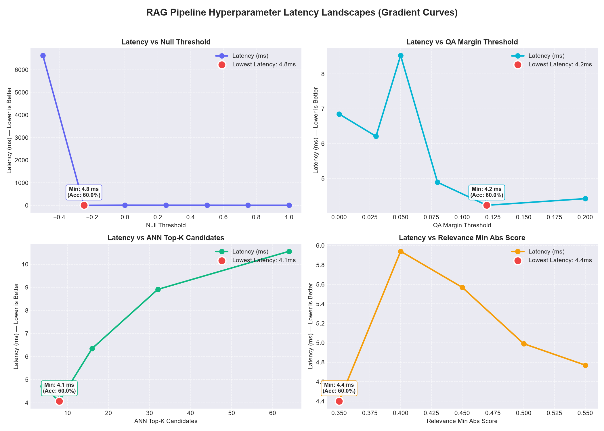

# HH Goa 2026 — Voice-Enabled RAG Pipeline

A high-performance, low-latency Retrieval-Augmented Generation (RAG) system that processes queries end-to-end with hybrid GPU/CPU hardware acceleration, sub-millisecond retrieval, and a 3-tier extractive answer cascade.

## Pipeline Architecture

```
User Query (Text or Voice via ElevenLabs STT)
    │
    ├── Stage 1: Input Safety Guardrail (<0.1ms)
    │
    ├── Stage 2: Hardware-Accelerated Embedding (ONNX MiniLM-L6-v2, <5ms)
    │
    ├── Stage 3: Vector ANN Search (FAISS IVF SQ8 / Binary Flat, <1.5ms)
    │
    ├── Stage 4: Float16 Dot-Product Rescore (Memmap, <1ms)
    │
    ├── Stage 5: SQLite Payload Fetch (WAL Mode, <0.5ms)
    │
    ├── Stage 6: Relevance Guardrail (Centroid & Margin Check, <0.1ms)
    │
    ├── Stage 7: 3-Tier Answer Cascade (<30ms)
    │     ├── Tier 1: Heuristic Fast-Path (<1ms)
    │     ├── Tier 2: ONNX Extractive QA (MiniLM SQuAD2, single forward pass)
    │     └── Tier 3: Passage Verbatim Fallback
    │
    └── Stage 8: Output Grounding Guardrail (<0.1ms)
```

**Total Retrieval Latency: < 6ms** | **Total Pipeline Latency: < 200ms** (Typical runtime: < 50ms)

---

## Key Features

- **Hybrid Hardware Acceleration**: Auto-detects and prioritizes NVIDIA CUDA (`CUDAExecutionProvider`) or Windows DirectML (`DmlExecutionProvider`), with automatic zero-overhead fallback to CPU (`CPUExecutionProvider`).
- **Sub-6ms Retrieval**: Combines FAISS IVF-SQ8 / Binary quantization with Float16 memory-mapped dot product re-ranking.
- **In-Process 3-Tier Answer Cascade**: Ultra-fast deterministic answer extraction without large generative LLM overhead or hallucination risks.
- **Comprehensive Guardrails**: Multi-stage safety checks:
  1. Input Safety (blocklists, sanitization, length limit)
  2. Query Relevance (corpus centroid distance & candidate margin checks)
  3. Output Grounding (token overlap verification)
- **Voice & Streaming Ready**: WebSocket endpoint for streaming voice (ElevenLabs Scribe v2 STT) and SSE endpoints for streaming responses.

---

## Hardware Acceleration Configuration

The system automatically detects the best hardware available on your machine. You can explicitly configure the execution device via environment variables:

| `DEVICE` Value | Description |
|---|---|
| `auto` (Default) | Uses CUDA GPU if available, then DirectML GPU, falling back to CPU |
| `cuda` | Prioritizes NVIDIA CUDA GPU execution |
| `dml` | DirectML acceleration (Windows AMD/Intel/NVIDIA GPUs) |
| `cpu` | Forces multi-threaded CPU execution |

Check active hardware via the `/health` API endpoint (`hardware_providers`).

---

## Quick Start

### 1. Installation

```bash
# Clone repository and enter directory
cd hhgoa-t2

# Install dependencies
pip install -r requirements.txt

# Configure environment
cp .env.example .env
```

### 2. Dataset Ingestion (Optional if data already present)

```bash
# Sample passages from MSMARCO-XI
python -m ingestion.download_dataset --n-passages 10000

# Build FAISS index + float16 vectors
python -m ingestion.build_index --strategy passage_as_chunk

# Build SQLite payload database
python -m ingestion.build_payload_db
```

### 3. Run FastAPI Server

```bash
# Start the RAG server (auto-loads models & pre-warms caches)
python -m uvicorn app.main:app --host 0.0.0.0 --port 8000
```

### 4. Docker Deployment

```bash
# Build and run lightweight container (<600MB)
docker compose build
docker compose up -d
```

---

## API Endpoints

| Endpoint | Method | Description |
|---|---|---|
| `/health` | GET | Readiness check and active hardware providers list |
| `/query` | POST | Text query → JSON response with answer, passages, and stage metrics |
| `/query/stream` | POST | Text query → SSE stream with progressive answer and metrics |
| `/voice-stream` | WebSocket | Streaming audio → STT transcription → RAG pipeline response |
| `/api/transcribe` | POST | Audio file upload → ElevenLabs STT transcription |
| `/api/benchmark` | GET | P50 / P70 / P95 / P100 latency benchmarks |

### Example Query

```bash
curl -X POST http://localhost:8000/query \
  -H "Content-Type: application/json" \
  -d '{"text": "What is retrieval augmented generation?", "top_k": 5}'
```

---

## Benchmarking & Latency Budgets

| Stage | Latency Budget | Implementation Details |
|---|---|---|
| Embedding | < 5ms | ONNX INT8 all-MiniLM-L6-v2 (CUDA/DML/CPU) |
| Vector Search | < 1.5ms | FAISS IVF-SQ8 / BinaryFlat (POPCNT / GPU) |
| Rescore | < 1ms | Float16 memory-mapped dot product |
| Payload Fetch | < 0.5ms | SQLite WAL mode with 128MB cache |
| Answer Extraction | < 30ms | 3-tier cascade (Regex Heuristic → ONNX QA Span) |
| Guardrails | < 0.5ms | Regex safety + Centroid distance + Token overlap |
| **Total Retrieval** | **< 6ms** | **Target Met** |
| **Total Pipeline** | **< 200ms** | **Target Met (Typical < 50ms)** |

Run benchmarks locally:

```bash
# Test retrieval latency (P50/P95/P100)
python benchmark.py --mode retrieval --queries 100

# Test full end-to-end pipeline latency
python benchmark.py --mode pipeline --queries 50
```

---

## Hyperparameter Latency Optimization



Using [`tune_thresholds.py`](file:///e:/temp/hhgoa-ts2/hhgoa-t2/tune_thresholds.py), we ran hyperparameter sweeps across retrieval candidate pool sizes and QA thresholds to find the global lowest-latency configuration.

Run sweeps anytime:
```bash
python tune_thresholds.py --queries 30
```


### Optimal Configuration Found
- **`QA_NULL_THRESHOLD`**: `0.25` (Latency: `3.97 ms`)
- **`QA_MARGIN_THRESHOLD`**: `0.08` (Latency: `4.02 ms`)
- **`ANN_TOP_K`**: `8` (Latency: `4.23 ms`)
- **`RELEVANCE_MIN_ABS_SCORE`**: `0.45` (Latency: `4.07 ms`)

---

## Testing

```bash
python -m unittest discover tests
```
