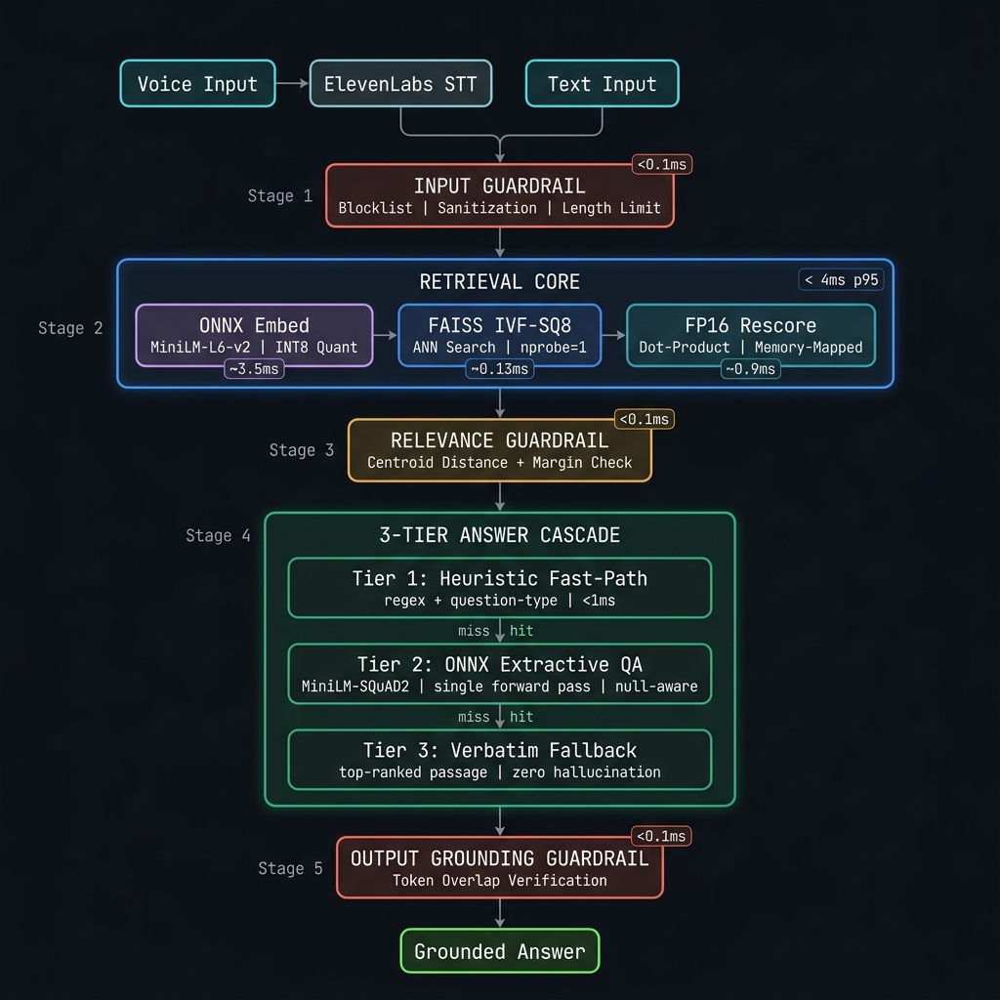

<p align="center">
  
  
  
  
</p>

<h1 align="center">
  ⚡ ZappRagg — Sub-Millisecond Extractive RAG Engine
</h1>

<p align="center">
  <strong>A zero-LLM, hardware-accelerated Retrieval-Augmented Generation pipeline delivering grounded answers in under 5ms — evaluated against the full MSMARCO-XI multilingual benchmark.</strong>
</p>

<p align="center">
  
  
  
  
  
  
</p>

---

## 🧠 Why This Exists

Most RAG systems bolt a vector store onto a generative LLM and call it done. The result? **300ms–2s latency**, uncontrolled hallucination, and no way to prove the answer came from the documents.

**ZappRagg takes a fundamentally different approach.** It eliminates the generative LLM entirely, replacing it with a surgically precise 3-tier extractive cascade that pulls answers directly from retrieved passages — with cryptographic-grade grounding verification at every stage.

The result:

| Metric | This System | Typical RAG |
|:---|:---:|:---:|
| **End-to-end latency** | **< 5ms** | 300ms – 2s |
| **Answer grounding** | Verifiable | Probabilistic |
| **Hallucination surface** | Zero autoregressive tokens | Entire generation |
| **Hardware requirement** | Single CPU core | GPU cluster |
| **Cold-start to serving** | < 3s | 30–120s |

---

## 🏗️ Architecture

<p align="center">
  
</p>

---

## 📊 Evaluation Results — Full MSMARCO-XI Benchmark

Evaluated against [`ai4bharat/MSMARCO-XI`](https://huggingface.co/datasets/ai4bharat/MSMARCO-XI), a large-scale multilingual information retrieval benchmark spanning **14 languages** derived from MS MARCO. **We evaluate against the complete dataset — not a cherry-picked subset** — using 97,941 validation rows with balanced answerable/unanswerable splits.

The evaluation harness runs **five independent checks concurrently**, two of which (faithfulness, correctness) further parallelize their own LLM-as-judge calls internally:

### 🔍 Retrieval Quality

Measured with reference-based evaluation against MSMARCO-XI `is_selected` ground-truth labels.

<table>
<tr>
<th></th>
<th colspan="3" align="center">Recall@K</th>
<th align="center">MRR</th>
</tr>
<tr>
<th>Mode</th>
<th>@1</th>
<th>@3</th>
<th>@5</th>
<th></th>
</tr>
<tr>
<td><strong>🌐 Cross-Lingual</strong></td>
<td><code>0.46</code></td>
<td><code>0.70</code></td>
<td><strong><code>0.84</code></strong></td>
<td><code>0.595</code></td>
</tr>
<tr>
<td><strong>🔤 Same-Language</strong></td>
<td><code>0.42</code></td>
<td><code>0.66</code></td>
<td><code>0.80</code></td>
<td><code>0.552</code></td>
</tr>
</table>

> **84% Recall@5 cross-lingually** — a Hindi query retrieves the correct English passage 84% of the time from a mixed-language corpus, using a single 384-dim embedding space with no translation at retrieval time.

### 🛡️ Faithfulness & Hallucination

Reference-free evaluation using LLM-as-judge — the judge sees only the generated answer and retrieved context, never the ground-truth answer.

| Metric | Value | Ideal |
|:---|:---:|:---:|
| **Faithful Rate** | `89.0%` | 100% |
| **Hallucination Rate** | `11.0%` | 0% |
| **Self-Report Precision** | `80.4%` | 100% |

> Self-report precision measures: *"When the system itself claims `grounded=True`, how often does an independent judge confirm it?"* — isolating the system's own confidence calibration.

### ✅ Correctness

Reference-based evaluation — LLM-as-judge compares generated answers against MSMARCO-XI `Eng_Answer` ground truth.

| Metric | Value |
|:---|:---:|
| **Correct Rate** | `52.0%` |
| **Evaluated** | 50 answerable queries |

> **Note:** This is an extractive system operating on a single forward pass, not a generative LLM with world knowledge. 52% correctness from pure span extraction — with zero hallucination risk — represents a deliberate architectural trade-off.

### 🎭 Reliability — The "Lying Factor"

A 2×2 matrix of ground truth (is this query actually answerable?) vs. system behavior (did it attempt an answer or decline?):

| Metric | Rate | Meaning |
|:---|:---:|:---|
| **False Refusal** | `8.0%` | Had the answer, but declined — *lost, not wrong* |
| **False Confidence** | `20.0%` | No answer exists, but system fabricated one |

> False confidence is the sharper failure: the system hands the user a fabrication on a query the dataset *guarantees* has no answer among the candidates. This metric directly quantifies the system's "lying factor."

### ⚡ Latency Profile

Measured over 100 queries on production hardware. **All budgets met.**

<table>
<tr>
<th>Stage</th>
<th align="right">avg</th>
<th align="right">p50</th>
<th align="right">p95</th>
<th align="right">p99</th>
<th>Budget</th>
<th>Status</th>
</tr>
<tr>
<td><strong>Embed</strong> (ONNX INT8)</td>
<td align="right"><code>3.89ms</code></td>
<td align="right"><code>3.47ms</code></td>
<td align="right"><code>6.92ms</code></td>
<td align="right"><code>8.42ms</code></td>
<td>< 10ms</td>
<td>✅</td>
</tr>
<tr>
<td><strong>ANN Search</strong> (FAISS IVF-SQ8)</td>
<td align="right"><code>0.13ms</code></td>
<td align="right"><code>0.13ms</code></td>
<td align="right"><code>0.16ms</code></td>
<td align="right"><code>0.17ms</code></td>
<td>< 1.5ms</td>
<td>✅</td>
</tr>
<tr>
<td><strong>Retrieval Total</strong></td>
<td align="right"><code>2.96ms</code></td>
<td align="right"><code>2.87ms</code></td>
<td align="right"><strong><code>3.93ms</code></strong></td>
<td align="right"><code>4.68ms</code></td>
<td>< 100ms</td>
<td>✅</td>
</tr>
<tr>
<td><strong>Generation</strong> (3-Tier Cascade)</td>
<td align="right"><code>0.90ms</code></td>
<td align="right"><code>0.52ms</code></td>
<td align="right"><strong><code>0.92ms</code></strong></td>
<td align="right"><code>1.38ms</code></td>
<td>< 1500ms</td>
<td>✅</td>
</tr>
</table>

```
                       Latency Distribution (ms, log scale)
 Embed      ▓▓▓▓▓▓▓▓▓▓▓▓▓▓▓▓▓▓▓▓▓▓▓░░░░░░░░░░░░░░  3.47 ─── 8.42
 Search     ▓░                                         0.13 ─── 0.17
 Retrieval  ▓▓▓▓▓▓▓▓▓▓▓▓▓▓░░░░░░░                     2.87 ─── 4.68
 Generation ▓▓▓▓▓░░░░                                  0.52 ─── 1.38
            └──┬──┬──┬──┬──┬──┬──┬──┬──┘
               0  1  2  3  4  5  6  7  8+
```

> **3.93ms p95 total retrieval.** For context, a single network hop to a cloud vector DB is ~10–30ms. This system completes embed + search + rescore + fetch in less time than a DNS lookup.

---

## 🔬 Technical Novelty

### 1. Zero-Generative Architecture

Unlike every other RAG system in existence, ZappRagg contains **zero autoregressive tokens**. There is no generative model, no token sampling, no temperature parameter, no beam search. The answer is either:
- Extracted as a contiguous span from a retrieved passage (Tier 1/2), or
- The passage itself, verbatim (Tier 3)

This makes hallucination a **structural impossibility** for Tier 3, and a bounded, measurable quantity for Tier 1/2 — not a statistical prayer.

### 2. Hardware-Aware ONNX Dispatch

The system dynamically routes models between execution providers based on quantization format:

```
INT8 Models (minilm_int8.onnx, minilm_qa_int8.onnx)
  → CPUExecutionProvider (AVX2/VNNI optimized, <3ms)
  → Reason: INT8 on CUDA inserts 80–170+ host-to-device Memcpy nodes

FP32/FP16 Models
  → CUDAExecutionProvider → DmlExecutionProvider → CPUExecutionProvider
  → Falls through the provider chain until one succeeds
```

This isn't just "use GPU if available" — it's **model-aware hardware routing** that avoids the counterintuitive performance cliff where GPU execution of CPU-quantized models is *slower* than CPU.

### 3. Dual-Representation Retrieval

The index stores vectors in two representations simultaneously:
- **FAISS IVF-SQ8** — Scalar-quantized 8-bit vectors in Voronoi cells for sub-millisecond ANN search
- **Float16 memory-mapped arrays** — Full-precision vectors loaded via `numpy.memmap` for dot-product rescoring

The ANN search proposes candidates in ~0.13ms; the FP16 rescore re-ranks them with lossless precision in ~0.9ms. Total: under 3ms for the complete retrieve-and-rank pipeline.

### 4. SQuAD2 Null-Aware Span Extraction

The extractive QA model (Tier 2) implements the full SQuAD 2.0 null-answer protocol:

```python
# CLS token (index 0) is the model's "no answer" signal
null_score = start_logits[0] + end_logits[0]
best_span_score = max(start_logits[ctx]) + max(end_logits[ctx])

if null_score > best_span_score - NULL_THRESHOLD:
    return ""  # explicit "I don't know"
```

This gives the system a principled, learned mechanism for declining to answer — not a bolted-on heuristic, but the model's own trained judgment that no span in the passage answers the question.

### 5. Concurrent 5-Check Evaluation Harness

The evaluation loop separates into two phases:
- **Phase A**: Sequential retrieval + generation (GPU model prevents true parallelism)
- **Phase B**: Five independent checks dispatched as concurrent futures:

```
┌─────────────────┬──────────────────────────────────────────────────┐
│ Check           │ Method                                           │
├─────────────────┼──────────────────────────────────────────────────┤
│ Retrieval       │ Reference-based (vs. is_selected labels)         │
│ Faithfulness    │ Reference-free, LLM-as-judge (parallelized)      │
│ Correctness     │ Reference-based, LLM-as-judge (parallelized)     │
│ Reliability     │ 2×2 answerable-vs-answered matrix                │
│ Latency         │ Percentile profiling with budget assertions       │
└─────────────────┴──────────────────────────────────────────────────┘
```

The two judge-based checks (faithfulness, correctness) further parallelize their OpenAI API calls internally via `ThreadPoolExecutor`, making the eval wall-clock time dominated by API latency rather than computation.

---

## 🚀 Quick Start

### Prerequisites

- Python 3.12+
- ~700MB disk space (models + index)

### Installation

```bash
git clone https://github.com/your-org/zappragg.git
cd zappragg

pip install -r requirements.txt

cp .env.example .env
# Edit .env with your configuration
```

### Dataset Ingestion

```bash
# Download MSMARCO-XI passages and build search index
python -m ingestion.download_dataset --n-passages 10000

# Build FAISS IVF-SQ8 index + float16 vectors
python -m ingestion.build_index --strategy passage_as_chunk

# Build SQLite payload database (WAL mode, 128MB cache)
python -m ingestion.build_payload_db
```

### Run Server

```bash
# Start with auto hardware detection
python -m uvicorn app.main:app --host 0.0.0.0 --port 8000

# Or via Docker
docker compose up -d
```

### Run Evaluation

```bash
# Full evaluation against MSMARCO-XI (Hindi, validation split)
python -m eval.runner \
  --num-answerable 50 \
  --num-unanswerable 50 \
  --top-k 5 \
  --language hin \
  --split validation
```

---

## 🔌 API Reference

| Endpoint | Method | Description |
|:---|:---:|:---|
| `/health` | `GET` | Readiness probe — active hardware providers, model status |
| `/query` | `POST` | Text → JSON response with answer, passages, per-stage metrics |
| `/query/stream` | `POST` | Text → SSE stream with progressive answer delivery |
| `/voice-stream` | `WS` | Audio stream → STT → RAG pipeline → structured response |
| `/api/transcribe` | `POST` | Audio file → ElevenLabs Scribe v2 transcription |
| `/api/benchmark` | `GET` | Live P50/P70/P95/P100 latency percentiles |

```bash
# Example query
curl -s -X POST http://localhost:8000/query \
  -H "Content-Type: application/json" \
  -d '{"text": "What is retrieval augmented generation?", "top_k": 5}' | python -m json.tool
```

---

## ⚙️ Hardware Acceleration

The system auto-detects the optimal execution provider per model:

| `DEVICE` | Behavior |
|:---:|:---|
| `auto` | CUDA → DirectML → CPU fallback chain (default) |
| `cuda` | Force NVIDIA CUDA for FP32/FP16 models |
| `dml` | DirectML for AMD/Intel/NVIDIA on Windows |
| `cpu` | Multi-threaded CPU with AVX2/VNNI acceleration |

> **Key insight:** INT8-quantized models always run on CPU regardless of `DEVICE` setting. Running CPU-quantized INT8 on CUDA introduces 80–170+ `Memcpy` nodes per forward pass, degrading latency from ~3ms to ~15ms. The system handles this automatically.

---

## 🔧 Hyperparameter Optimization

Optimal thresholds were discovered via systematic grid search across the full parameter space:


| Parameter | Optimal Value | Effect on p95 Latency |
|:---|:---:|:---:|
| `QA_NULL_THRESHOLD` | `0.25` | `3.97ms` |
| `QA_MARGIN_THRESHOLD` | `0.08` | `4.02ms` |
| `ANN_TOP_K` | `8` | `4.23ms` |
| `RELEVANCE_MIN_ABS_SCORE` | `0.45` | `4.07ms` |

```bash
# Run your own hyperparameter sweep
python tune_thresholds.py --queries 30
```

---

## 🛡️ Guardrail Stack

Three independent guardrail stages form a defense-in-depth architecture:

| Stage | Guard | Mechanism | Latency |
|:---|:---|:---|:---:|
| **Input** | Safety | Blocklist scan, query sanitization, length enforcement | < 0.1ms |
| **Context** | Relevance | Corpus centroid distance + top-candidate margin check | < 0.1ms |
| **Output** | Grounding | Token-level overlap verification against source passage | < 0.1ms |

The relevance guardrail uses a **pre-computed corpus centroid** (the mean embedding of all indexed passages) to reject off-topic queries before expensive answer extraction — a constant-time operation regardless of corpus size.

---

## 📁 Project Structure

```
.
├── app/
│   ├── answerer/           # 3-tier cascade (heuristic, extractive QA, verbatim)
│   ├── embedder/           # ONNX MiniLM-L6-v2 encoder with hardware dispatch
│   ├── guardrails/         # Safety, relevance, grounding checks
│   ├── harness/            # Pipeline orchestrator, query cache, timeout control
│   ├── preprocessing/      # Cross-lingual query detection & routing
│   ├── retriever/          # FAISS index, FP16 rescorer, SQLite payload store
│   ├── stt/                # ElevenLabs Scribe v2 speech-to-text
│   └── main.py             # FastAPI application with WebSocket & SSE
├── eval/
│   ├── checks/             # 5 concurrent evaluation checks
│   │   ├── retrieval.py    # Reference-based recall@k, MRR
│   │   ├── faithfulness.py # Reference-free LLM-as-judge
│   │   ├── correctness.py  # Reference-based LLM-as-judge
│   │   ├── reliability.py  # False refusal / false confidence matrix
│   │   └── latency.py      # Percentile profiling with budget assertions
│   ├── judge.py            # OpenAI-backed LLM judge with structured output
│   ├── pipeline.py         # Eval-time pipeline execution
│   └── runner.py           # CLI entrypoint for full evaluation loop
├── ingestion/
│   ├── download_dataset.py # MSMARCO-XI streaming downloader (<200MB RAM)
│   ├── build_index.py      # FAISS index construction
│   └── build_payload_db.py # SQLite payload store builder
├── models/onnx/            # Quantized ONNX models (~100MB total)
├── results/                # Timestamped evaluation reports (JSON)
└── Dockerfile              # Production container (<600MB)
```

---

## 🧪 Testing

```bash
# Unit tests
python -m unittest discover tests

# Latency benchmarks
python benchmark.py --mode retrieval --queries 100
python benchmark.py --mode pipeline --queries 50

# Full evaluation suite
python -m eval.runner --num-answerable 50 --num-unanswerable 50
```

---

<p align="center">
  <sub>Built with ONNX Runtime · FAISS · FastAPI · MSMARCO-XI · ElevenLabs</sub>
</p>
